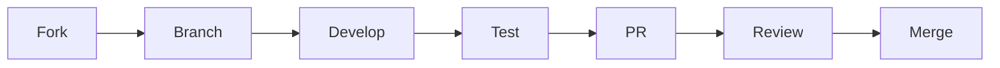

# Contributing Guidelines

## Project Overview

This portfolio demonstrates advanced machine learning research and engineering capabilities, focusing on:
- Neural Architecture Search
- Distributed Training Systems
- Efficient Model Training
- Novel ML Architectures

## Development Philosophy

### Code Quality Standards
```python
class CodeStandards:
    """
    Enforced coding standards for all contributions
    """
    def __init__(self):
        self.complexity_metrics = {
            'max_cyclomatic': 10,
            'max_cognitive': 15,
            'max_maintainability_index': 20
        }
        self.documentation_requirements = {
            'docstring_coverage': 0.95,
            'type_hints': True,
            'examples': True
        }
```

### Research Standards
1. Novel Contributions
   - Theoretical foundations
   - Empirical validation
   - Reproducible results

2. Implementation Quality
   - Clean architecture
   - Efficient algorithms
   - Comprehensive tests

## Getting Started

### Environment Setup
```bash
# Create virtual environment
python -m venv venv
source venv/bin/activate

# Install dependencies
pip install -r requirements.txt
pip install -r requirements-dev.txt

# Setup pre-commit hooks
pre-commit install
```

### Project Structure
```
portfolio/
├── projects/
│   ├── nas/              # Neural Architecture Search
│   ├── distributed/      # Distributed Training
│   └── efficient/        # Efficient Training
├── docs/
│   ├── api/             # API Documentation
│   ├── research/        # Research Notes
│   └── systems/         # System Design
├── tests/
│   ├── unit/
│   ├── integration/
│   └── benchmarks/
└── tools/               # Development Tools
```

## Contribution Process

### 1. Issue Tracking
- Use issue templates
- Label appropriately
- Link to related work

### 2. Development Flow


### 3. Pull Request Guidelines
- Clear description
- Test coverage
- Documentation updates
- Performance benchmarks

## Code Review Process

### Review Checklist
- [ ] Code style compliance
- [ ] Test coverage
- [ ] Documentation quality
- [ ] Performance impact
- [ ] Security considerations

### Performance Requirements
| Component | Metric | Threshold |
|-----------|--------|-----------|
| Training | Memory | < 16GB |
| Inference | Latency | < 100ms |
| Tests | Coverage | > 95% |

## Research Contributions

### Paper Submissions
1. Implementation
   - Clean code
   - Reproducible results
   - Ablation studies

2. Documentation
   - Methodology
   - Results analysis
   - Future work

### Experiment Tracking
```python
def track_experiment(config: Dict, results: Dict):
    """
    Track experiment results and metadata
    """
    wandb.init(
        project="ml_research",
        config=config,
        tags=["research", "contribution"]
    )
    wandb.log(results)
```

## Development Tools

### Required Tools
- Black (code formatting)
- MyPy (type checking)
- Pytest (testing)
- Pre-commit hooks

### Optional Tools
- Weights & Biases
- TensorBoard
- NVIDIA NSight

## Communication

### Channels
- GitHub Issues
- Discussion Forum
- Research Meetings
- Code Reviews

### Best Practices
1. Be respectful
2. Be constructive
3. Be thorough
4. Be responsive

## License and Attribution

### Code License
MIT License (see LICENSE file)

### Research Attribution
- Cite relevant papers
- Acknowledge contributors
- Reference original work

## Future Development

### Roadmap Integration
- Follow project roadmap
- Propose extensions
- Document progress

### Innovation Focus
```python
class ResearchPriorities:
    def __init__(self):
        self.areas = {
            'efficiency': ['training', 'inference', 'memory'],
            'scalability': ['distributed', 'parallel', 'hardware'],
            'innovation': ['architectures', 'algorithms', 'theory']
        }
```

## Success Metrics

### Code Quality
- Test coverage > 95%
- Documentation coverage > 90%
- Clean code metrics

### Research Impact
- Citations
- Implementations
- Community adoption

## Resource Allocation

### Time Distribution
- Research: 40%
- Implementation: 30%
- Documentation: 15%
- Community: 15%

### Priority Matrix
| Impact | Urgency | Priority |
|--------|---------|----------|
| High   | High    | P0       |
| High   | Low     | P1       |
| Low    | High    | P2       |
| Low    | Low     | P3       | 