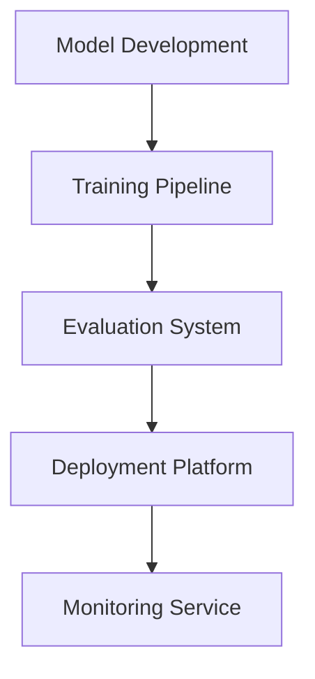

# Portfolio Development Roadmap

## Phase 1: Foundation (Current)

### Machine Learning Core
- [x] Neural Architecture Search Implementation
- [x] Distributed Training System
- [x] Efficient Training Techniques
- [ ] AutoML Pipeline
- [ ] Custom Model Architectures

### Documentation
- [x] Technical Blog Posts
- [x] System Specifications
- [ ] API Documentation
- [ ] Performance Benchmarks
- [ ] Research Notes

## Phase 2: Advanced Features (Q2 2024)

### Research Implementations
```python
planned_implementations = {
    'transformers': ['sparse_attention', 'linear_scaling', 'efficient_routing'],
    'optimization': ['neural_gradients', 'adaptive_methods', 'meta_learning'],
    'architectures': ['dynamic_networks', 'neural_operators', 'hybrid_models']
}
```

### System Scaling
- Distributed Training Framework
- Multi-GPU Optimization
- Cross-Platform Deployment
- Resource Management System

## Phase 3: Innovation (Q3 2024)

### Novel Research Directions
1. Meta-Learning Systems
   - Architecture Generation
   - Hyperparameter Optimization
   - Neural Reward Modeling

2. Efficient Computing
   - Custom CUDA Kernels
   - Quantization Framework
   - Sparse Computation Engine

3. Advanced Applications
   - Multi-Modal Learning
   - Few-Shot Adaptation
   - Continual Learning

## Phase 4: Production (Q4 2024)

### Infrastructure


### MLOps Integration
- CI/CD Pipeline
- Model Versioning
- A/B Testing Framework
- Performance Monitoring

## Phase 5: Research Extensions (2025)

### Theoretical Foundations
- Information Theory Applications
- Optimization Theory
- Statistical Learning Bounds

### Novel Architectures
- Quantum-Inspired Models
- Neuromorphic Computing
- Hybrid Classical-Quantum Systems

## Continuous Development

### Code Quality
- Unit Test Coverage: 95%
- Integration Tests
- Performance Benchmarks
- Documentation Coverage

### Research Output
- Conference Papers
- Technical Reports
- Blog Series
- Workshop Materials

## Innovation Metrics
```python
class InnovationTracking:
    def __init__(self):
        self.metrics = {
            'research_impact': ['citations', 'implementations', 'community_adoption'],
            'technical_depth': ['complexity', 'efficiency', 'scalability'],
            'practical_value': ['deployment_ease', 'maintenance_cost', 'performance_gain']
        }
        
    def evaluate_progress(self):
        return {
            metric: self.compute_score(category)
            for category in self.metrics
            for metric in self.metrics[category]
        }
```

## Future Directions

### Research Areas
1. Theoretical ML
   - Sample Complexity
   - Generalization Bounds
   - Optimization Dynamics

2. Systems ML
   - Hardware Co-design
   - Efficient Training
   - Deployment Optimization

3. Applied ML
   - Domain Adaptation
   - Transfer Learning
   - Multi-task Systems

### Development Focus
- Algorithm Efficiency
- System Scalability
- Research Innovation
- Production Readiness

## Success Metrics
| Area | Metric | Target |
|------|---------|--------|
| Research | Papers Published | 4/year |
| Engineering | System Performance | 2x baseline |
| Innovation | Novel Methods | 3/quarter |
| Impact | Community Adoption | 1000 stars |

## Resource Allocation
- Research: 40%
- Development: 30%
- Documentation: 15%
- Community: 15% 