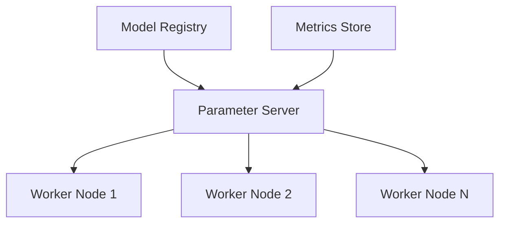

# Distributed Training System Specification

## System Architecture

### 1. Component Overview


### 2. Key Components

#### 2.1 Parameter Server
- Gradient aggregation
- Weight distribution
- Synchronization management
- Fault tolerance handling

#### 2.2 Worker Nodes
- Local batch processing
- Gradient computation
- Model evaluation
- Data preprocessing

#### 2.3 Supporting Infrastructure
- Model versioning
- Metrics collection
- Resource allocation
- Network optimization

## Implementation Details

### 1. Communication Protocol
```python
class DistributedTrainer:
    def __init__(self, world_size, rank):
        self.world_size = world_size
        self.rank = rank
        self.setup_communication()
        
    def setup_communication(self):
        self.group = dist.new_group(ranks=list(range(self.world_size)))
        
    def sync_gradients(self, gradients):
        dist.all_reduce(gradients, op=dist.ReduceOp.SUM, group=self.group)
        gradients /= self.world_size
```

### 2. Fault Tolerance
- Checkpoint management
- Node recovery
- State synchronization
- Data consistency

### 3. Performance Optimization
- Gradient compression
- Async communication
- Memory management
- Bandwidth optimization

## Scaling Considerations

### 1. Hardware Requirements
| Component | CPU | Memory | Network |
|-----------|-----|---------|----------|
| Parameter Server | 32 cores | 128GB | 10Gbps |
| Worker Node | 16 cores | 64GB | 5Gbps |
| Model Registry | 8 cores | 32GB | 1Gbps |

### 2. Scaling Limits
- Linear scaling up to 64 nodes
- Network bandwidth bottlenecks
- Memory constraints
- Synchronization overhead

## Monitoring and Metrics

### 1. System Metrics
- Node health
- Network latency
- Memory usage
- GPU utilization

### 2. Training Metrics
- Loss convergence
- Gradient norm
- Learning rate
- Model performance

## Future Enhancements
1. Dynamic resource allocation
2. Automated hyperparameter tuning
3. Multi-GPU optimization
4. Cross-datacenter training 