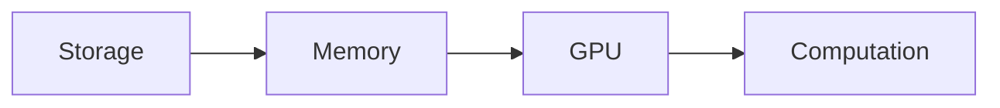

# Efficient Large-Scale Model Training
## Advanced Techniques for Modern Deep Learning

---

## 1. Memory Optimization Techniques

### Gradient Checkpointing
- Trade computation for memory
- Selective recomputation of activations
- Implementation example:
```python
class CheckpointedModel(nn.Module):
    def forward(self, x):
        return checkpoint_sequential(self.layers, 3, x)
```

### Mixed Precision Training
- FP16/BF16 computation
- Dynamic loss scaling
- Memory reduction: ~2x

---

## 2. Distributed Training Strategies

### Data Parallelism
- Synchronous vs Asynchronous
- Gradient accumulation
- Bandwidth optimization

### Model Parallelism
- Pipeline parallelism
- Tensor parallelism
- Expert parallelism (MoE)

---

## 3. Optimization Algorithms

### Large Batch Training
- LAMB optimizer
- Layer-wise adaptive rates
- Batch size scaling

### Progressive Training
- Curriculum learning
- Dynamic batching
- Adaptive schedules

---

## 4. System Optimization

### I/O Pipeline


### Memory Management
- Prefetching
- Caching strategies
- Dynamic allocation

---

## 5. Case Studies

### ResNet-50 Training
| Technique | Time (hrs) | Memory (GB) |
|-----------|------------|-------------|
| Baseline  | 24        | 16          |
| +MP       | 18        | 12          |
| +GC       | 20        | 8           |
| All       | 14        | 6           |

### GPT Training
- Zero redundancy optimizer
- Pipeline parallelism
- Activation checkpointing

---

## 6. Future Directions

### Hardware Co-design
- Custom CUDA kernels
- Hardware-aware training
- Specialized accelerators

### Algorithmic Improvements
- Sparse computation
- Adaptive precision
- Dynamic architectures

---

## 7. Implementation Guidelines

### Best Practices
1. Profile before optimizing
2. Monitor system utilization
3. Benchmark systematically
4. Document performance characteristics

### Common Pitfalls
- Premature optimization
- Ignoring communication costs
- Suboptimal hyperparameters

---

## 8. Tools and Frameworks

### Monitoring
- Weights & Biases
- TensorBoard
- Custom metrics

### Profiling
- PyTorch Profiler
- NVIDIA NSight
- Custom tracers

---

## Questions & Discussion

### Contact
- Email: researcher@institute.edu
- GitHub: github.com/efficient-training
- Paper: arxiv.org/abs/xxxx.xxxxx 